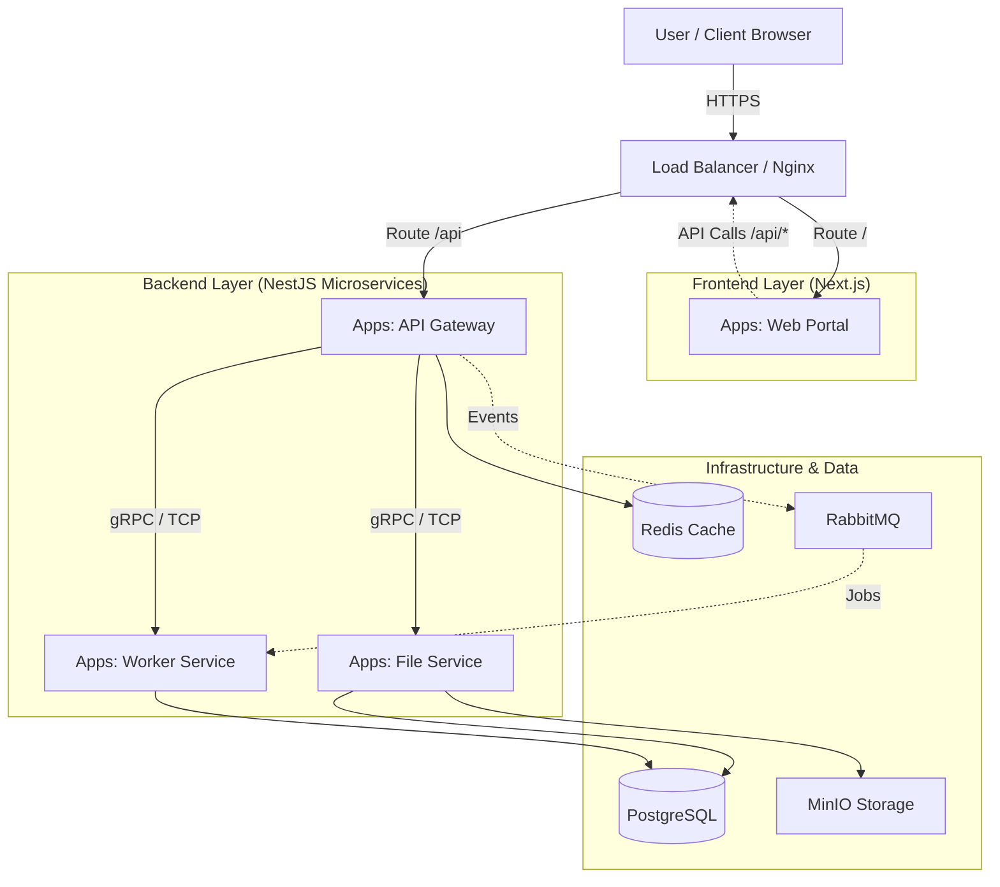

# 🚀 Deployment & Operations Guide

## 📋 Table of Contents

1. [System Architecture](#system-architecture)
2. [Prerequisites](#prerequisites)
3. [Installation](#installation)
4. [Configuration](#configuration)
5. [Deployment](#deployment)
6. [Monitoring](#monitoring)
7. [Troubleshooting](#troubleshooting)
8. [Maintenance](#maintenance)
9. [Security](#security)
10. [Backup & Recovery](#backup--recovery)

---

## 🏗️ System Architecture

### Overview

## 🏗️ System Architecture

### Nx Monorepo Structure & Data Flow

This architecture leverages **Nx Monorepo** to manage both Frontend and Backend applications, ensuring type safety and code sharing via Shared Libraries.



### Component Roles

1.  **Frontend Layer (`apps/clients/*`)**:
    *   **Web Portal**: Next.js application serving the UI. It consumes APIs via the Load Balancer (mapped to `/api`).
    *   **Direct Access**: Users access this layer to load the application bundle.

2.  **API Gateway (`apps/gateway`)**:
    *   **Single Entry Point**: All API requests from the Frontend go through here.
    *   **Responsibilities**: Authentication, Rate Limiting, Request Validation, Routing to internal services.

3.  **Microservices (`apps/*-service`)**:
    *   **File Service**: Handles file uploads, downloads, and storage (MinIO).
    *   **Worker Service**: Handles background jobs, heavy processing (PDF generation, CSV imports).
    *   **Isolation**: These services are **NOT** exposed directly to the public internet. They communicate via internal TCP/gRPC or Message Queue.

4.  **Shared Libraries (`libs/shared/*`)**:
    *   **Code Sharing**: DTOs, Interfaces, Utilities, and **Logger** are shared between Frontend and Backend to ensure consistency (e.g., same validation rules, same types).


---

## 📦 Prerequisites

### System Requirements

**Production Server:**
- OS: Ubuntu 22.04 LTS / Rocky Linux 9
- CPU: 4 cores minimum (8 cores recommended)
- RAM: 8 GB minimum (16 GB recommended)
- Disk: 100 GB SSD minimum (500 GB recommended)
- Network: 1 Gbps

**Development Machine:**
- OS: Windows 10/11, macOS, or Linux
- RAM: 8 GB minimum
- Node.js: v20 LTS
- Docker: Latest stable

### Software Dependencies

```bash
# Node.js & Package Manager
node -v  # v20.x.x
npm -v   # v10.x.x
yarn -v  # v1.22.x

# Docker & Container
docker -v                # v24.x.x
docker-compose -v        # v2.x.x

# Database Tools
psql --version           # PostgreSQL 16
redis-cli --version      # Redis 7
```

---

## 📥 Installation

### 1. Clone Repository

```bash
git clone https://github.com/your-org/nx-project.git
cd nx-project
```

### 2. Install Dependencies

```bash
# Install all packages
npm install

# Or using yarn
yarn install
```

### 3. Environment Setup

```bash
# Copy environment template
cp .env.example .env

# Edit configuration
nano .env
```

**Required Environment Variables:**

```env
# Application
NODE_ENV=production
PORT=3000

# Database
DATABASE_HOST=localhost
DATABASE_PORT=5432
DATABASE_NAME=nx_production
DATABASE_USER=postgres
DATABASE_PASSWORD=secure_password

# Redis
REDIS_HOST=localhost
REDIS_PORT=6379
REDIS_PASSWORD=redis_password

# RabbitMQ
RABBITMQ_HOST=localhost
RABBITMQ_PORT=5672
RABBITMQ_USER=admin
RABBITMQ_PASSWORD=rabbitmq_password

# MinIO
MINIO_ENDPOINT=localhost
MINIO_PORT=9000
MINIO_ACCESS_KEY=minio_access_key
MINIO_SECRET_KEY=minio_secret_key

# JWT
JWT_SECRET=your_super_secret_key_change_this
JWT_EXPIRES_IN=7d

# Logging
LOG_LEVEL=info
LOKI_URL=http://localhost:3100
```

---

## ⚙️ Configuration

### Database Configuration

**PostgreSQL Setup:**

```sql
-- Create database
CREATE DATABASE nx_production;

-- Create user
CREATE USER nx_user WITH PASSWORD 'secure_password';

-- Grant privileges
GRANT ALL PRIVILEGES ON DATABASE nx_production TO nx_user;

-- Enable extensions
\c nx_production
CREATE EXTENSION IF NOT EXISTS "uuid-ossp";
CREATE EXTENSION IF NOT EXISTS "pg_stat_statements";
```

**Connection Pooling:**

```typescript
// libs/ts/config/src/lib/database.config.ts
export const databaseConfig = {
  type: 'postgres',
  host: process.env.DATABASE_HOST,
  port: parseInt(process.env.DATABASE_PORT || '5432'),
  username: process.env.DATABASE_USER,
  password: process.env.DATABASE_PASSWORD,
  database: process.env.DATABASE_NAME,
  // Pool settings
  extra: {
    max: 20,              // Max connections
    min: 5,               // Min connections
    idleTimeoutMillis: 30000,
    connectionTimeoutMillis: 2000,
  },
};
```

### Redis Configuration

```bash
# Redis config (redis.conf)
maxmemory 2gb
maxmemory-policy allkeys-lru
save 900 1
save 300 10
save 60 10000
```

### Docker Compose

```yaml
# docker-compose.production.yml
version: '3.8'

services:
  # PostgreSQL
  postgres:
    image: postgres:16
    environment:
      POSTGRES_DB: nx_production
      POSTGRES_USER: nx_user
      POSTGRES_PASSWORD: ${DATABASE_PASSWORD}
    volumes:
      - postgres_data:/var/lib/postgresql/data
    ports:
      - "5432:5432"
    restart: unless-stopped

  # Redis
  redis:
    image: redis:7-alpine
    command: redis-server --requirepass ${REDIS_PASSWORD}
    volumes:
      - redis_data:/data
    ports:
      - "6379:6379"
    restart: unless-stopped

  # RabbitMQ
  rabbitmq:
    image: rabbitmq:3-management-alpine
    environment:
      RABBITMQ_DEFAULT_USER: ${RABBITMQ_USER}
      RABBITMQ_DEFAULT_PASS: ${RABBITMQ_PASSWORD}
    volumes:
      - rabbitmq_data:/var/lib/rabbitmq
    ports:
      - "5672:5672"
      - "15672:15672"
    restart: unless-stopped

  # MinIO
  minio:
    image: minio/minio:latest
    command: server /data --console-address ":9001"
    environment:
      MINIO_ROOT_USER: ${MINIO_ACCESS_KEY}
      MINIO_ROOT_PASSWORD: ${MINIO_SECRET_KEY}
    volumes:
      - minio_data:/data
    ports:
      - "9000:9000"
      - "9001:9001"
    restart: unless-stopped

volumes:
  postgres_data:
  redis_data:
  rabbitmq_data:
  minio_data:
```

---

## 🚀 Deployment

### Build for Production

```bash
# Build all apps
npm run build

# Or build specific app
nx build api-gateway --configuration=production
nx build web-portal --configuration=production
```

### Deployment Methods

#### Method 1: Docker Deployment

```bash
# Build Docker images
docker build -t nx-api:latest -f apps/api-gateway/Dockerfile .
docker build -t nx-web:latest -f apps/web-portal/Dockerfile .

# Run containers
docker-compose -f docker-compose.production.yml up -d
```

#### Method 2: PM2 Deployment

```bash
# Install PM2
npm install -g pm2

# Start backend
pm2 start dist/apps/api-gateway/main.js --name api-gateway

# Start frontend
pm2 start npm --name web-portal -- start

# Save PM2 config
pm2 save

# Setup startup script
pm2 startup
```

**PM2 Ecosystem File:**

```javascript
// ecosystem.config.js
module.exports = {
  apps: [
    {
      name: 'api-gateway',
      script: 'dist/apps/api-gateway/main.js',
      instances: 4,
      exec_mode: 'cluster',
      env: {
        NODE_ENV: 'production',
        PORT: 3000,
      },
    },
    {
      name: 'file-service',
      script: 'dist/apps/file-service/main.js',
      instances: 2,
      exec_mode: 'cluster',
      env: {
        NODE_ENV: 'production',
        PORT: 3001,
      },
    },
    {
      name: 'worker-service',
      script: 'dist/apps/worker-service/main.js',
      instances: 2,
      exec_mode: 'cluster',
      env: {
        NODE_ENV: 'production',
      },
    },
  ],
};
```

#### Method 3: Kubernetes Deployment

```yaml
# k8s/api-deployment.yaml
apiVersion: apps/v1
kind: Deployment
metadata:
  name: api-gateway
spec:
  replicas: 3
  selector:
    matchLabels:
      app: api-gateway
  template:
    metadata:
      labels:
        app: api-gateway
    spec:
      containers:
      - name: api-gateway
        image: nx-api:latest
        ports:
        - containerPort: 3000
        env:
        - name: NODE_ENV
          value: "production"
        - name: DATABASE_HOST
          valueFrom:
            secretKeyRef:
              name: db-credentials
              key: host
        resources:
          requests:
            memory: "512Mi"
            cpu: "500m"
          limits:
            memory: "1Gi"
            cpu: "1000m"
        livenessProbe:
          httpGet:
            path: /health
            port: 3000
          initialDelaySeconds: 30
          periodSeconds: 10
        readinessProbe:
          httpGet:
            path: /health/ready
            port: 3000
          initialDelaySeconds: 10
          periodSeconds: 5
```

---

## 📊 Monitoring

### Health Checks

**Endpoints:**
- `GET /health` - Basic health check
- `GET /health/ready` - Readiness probe
- `GET /health/live` - Liveness probe
- `GET /metrics` - Prometheus metrics

**Implementation:**

```typescript
// apps/api-gateway/src/health/health.controller.ts
@Controller('health')
export class HealthController {
  constructor(
    private health: HealthCheckService,
    private db: TypeOrmHealthIndicator,
    private redis: RedisHealthIndicator,
  ) {}

  @Get()
  @HealthCheck()
  check() {
    return this.health.check([
      () => this.db.pingCheck('database'),
      () => this.redis.pingCheck('redis'),
    ]);
  }
}
```

### Logging

**Access Logs:**
```bash
# View logs
tail -f logs/combined-$(date +%Y-%m-%d).log

# Error logs
tail -f logs/error-$(date +%Y-%m-%d).log

# PM2 logs
pm2 logs api-gateway
```

**Grafana Dashboards:**
- Application Metrics
- Request Rate & Latency
- Error Rate
- Resource Usage (CPU, Memory)
- Database Performance

---

## 🔧 Troubleshooting

### Common Issues

#### Issue 1: Database Connection Failed

**Symptom:**
```
Error: connect ECONNREFUSED 127.0.0.1:5432
```

**Solution:**
```bash
# Check PostgreSQL status
sudo systemctl status postgresql

# Restart PostgreSQL
sudo systemctl restart postgresql

# Check connection
psql -h localhost -U nx_user -d nx_production
```

#### Issue 2: High Memory Usage

**Symptom:**
```
FATAL ERROR: Reached heap limit
```

**Solution:**
```bash
# Increase Node.js memory
export NODE_OPTIONS="--max-old-space-size=4096"

# Or in PM2
pm2 start app.js --node-args="--max-old-space-size=4096"
```

#### Issue 3: Redis Connection Timeout

**Symptom:**
```
Error: connect ETIMEDOUT
```

**Solution:**
```bash
# Check Redis
redis-cli ping

# Restart Redis
sudo systemctl restart redis

# Check firewall
sudo ufw allow 6379/tcp
```

---

## 🔒 Security

### Best Practices

1. **Environment Variables**
   - Never commit `.env` files
   - Use secrets management (Vault, AWS Secrets Manager)

2. **Database Security**
   - Use strong passwords
   - Enable SSL/TLS connections
   - Regular backups

3. **API Security**
   - Enable rate limiting
   - Use CORS properly
   - Implement helmet.js

4. **File Upload**
   - Validate file types
   - Scan for malware
   - Limit file sizes

### SSL/TLS Configuration

```nginx
# nginx.conf
server {
    listen 443 ssl http2;
    server_name api.yourdomain.com;

    ssl_certificate /etc/ssl/certs/cert.pem;
    ssl_certificate_key /etc/ssl/private/key.pem;

    ssl_protocols TLSv1.2 TLSv1.3;
    ssl_ciphers HIGH:!aNULL:!MD5;

    location / {
        proxy_pass http://localhost:3000;
        proxy_http_version 1.1;
        proxy_set_header Upgrade $http_upgrade;
        proxy_set_header Connection 'upgrade';
        proxy_set_header Host $host;
        proxy_cache_bypass $http_upgrade;
    }
}
```

---

## 💾 Backup & Recovery

### Database Backup

```bash
# Daily backup script
#!/bin/bash
BACKUP_DIR="/backup/postgresql"
DATE=$(date +%Y-%m-%d)

pg_dump -h localhost -U nx_user nx_production | gzip > \
  $BACKUP_DIR/nx_production_$DATE.sql.gz

# Keep last 30 days
find $BACKUP_DIR -name "*.sql.gz" -mtime +30 -delete
```

### Automated Backup (Cron)

```bash
# Add to crontab
crontab -e

# Daily backup at 2 AM
0 2 * * * /scripts/backup-database.sh
```

### Restore Database

```bash
# Restore from backup
gunzip < /backup/postgresql/nx_production_2025-12-05.sql.gz | \
  psql -h localhost -U nx_user nx_production
```

---

## 📈 Scaling

### Horizontal Scaling

**Load Balancer (Nginx):**

```nginx
upstream api_backend {
    least_conn;
    server api1.local:3000;
    server api2.local:3000;
    server api3.local:3000;
}

server {
    listen 80;
    location / {
        proxy_pass http://api_backend;
    }
}
```

### Vertical Scaling

**Resource Limits:**

```yaml
# docker-compose.yml
services:
  api:
    deploy:
      resources:
        limits:
          cpus: '2.0'
          memory: 4G
        reservations:
          cpus: '1.0'
          memory: 2G
```

---

## 📞 Support

**Documentation:** https://docs.yourdomain.com  
**Issues:** https://github.com/your-org/nx-project/issues  
**Email:** support@yourdomain.com

---

**Production deployment checklist:**
- [ ] Environment variables configured
- [ ] Database migrations applied
- [ ] SSL certificates installed
- [ ] Monitoring dashboards set up
- [ ] Backup scripts configured
- [ ] Load balancer configured
- [ ] Health checks working
- [ ] Logging enabled
- [ ] Security hardening done
- [ ] Performance testing completed

**System is ready for production! 🚀**
