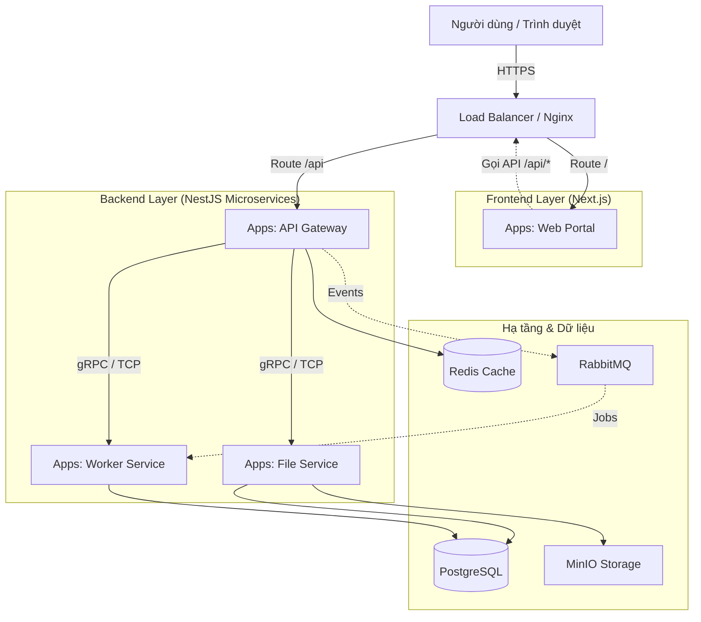

# 🚀 Hướng Dẫn Triển Khai & Vận Hành

## 📋 Mục Lục

1. [Kiến Trúc Hệ Thống](#kiến-trúc-hệ-thống)
2. [Yêu Cầu Tiên Quyết](#yêu-cầu-tiên-quyết)
3. [Cài Đặt](#cài-đặt)
4. [Cấu Hình](#cấu-hình)
5. [Triển Khai](#triển-khai)
6. [Giám Sát](#giám-sát)
7. [Xử Lý Sự Cố](#xử-lý-sự-cố)
8. [Bảo Trì](#bảo-trì)
9. [Bảo Mật](#bảo-mật)
10. [Sao Lưu & Phục Hồi](#sao-lưu--phục-hồi)

---

## 🏗️ Kiến Trúc Hệ Thống

### Tổng Quan

## 🏗️ Kiến Trúc Hệ Thống
### Cấu Trúc Nx Monorepo & Luồng Dữ Liệu

Kiến trúc này tận dụng **Nx Monorepo** để quản lý cả Frontend và Backend, đảm bảo tính nhất quán về kiểu dữ liệu (type safety) và chia sẻ code thông qua Shared Libraries.



### Vai Trò Các Thành Phần

1.  **Frontend Layer (`apps/clients/*`)**:
    *   **Web Portal**: Ứng dụng Next.js phục vụ giao diện người dùng. Nó gọi API thông qua Load Balancer (được map vào `/api`).
    *   **Truy cập trực tiếp**: Người dùng truy cập layer này để tải bundle ứng dụng.

2.  **API Gateway (`apps/gateway`)**:
    *   **Điểm truy cập duy nhất**: Tất cả request API từ Frontend đều đi qua đây.
    *   **Trách nhiệm**: Xác thực (Auth), Giới hạn truy cập (Rate Limiting), Validate request, Định tuyến đến các service nội bộ.

3.  **Microservices (`apps/*-service`)**:
    *   **File Service**: Xử lý upload, download và lưu trữ file (MinIO).
    *   **Worker Service**: Xử lý các tác vụ nền, xử lý nặng (tạo PDF, import CSV).
    *   **Cô lập**: Các service này **KHÔNG** được public trực tiếp ra internet. Chúng giao tiếp qua TCP/gRPC nội bộ hoặc Message Queue.

4.  **Shared Libraries (`libs/shared/*`)**:
    *   **Chia sẻ Code**: DTOs, Interfaces, Utilities, và **Logger** được dùng chung giữa Frontend và Backend để đảm bảo tính nhất quán (ví dụ: cùng quy tắc validate, cùng kiểu dữ liệu).


---

## 📦 Yêu Cầu Tiên Quyết

### Yêu Cầu Hệ Thống

**Máy chủ Production:**
- OS: Ubuntu 22.04 LTS / Rocky Linux 9
- CPU: Tối thiểu 4 cores (khuyến nghị 8 cores)
- RAM: Tối thiểu 8 GB (khuyến nghị 16 GB)
- Ổ cứng: Tối thiểu 100 GB SSD (khuyến nghị 500 GB)
- Mạng: 1 Gbps

**Máy phát triển:**
- OS: Windows 10/11, macOS, hoặc Linux
- RAM: Tối thiểu 8 GB
- Node.js: v20 LTS
- Docker: Phiên bản ổn định mới nhất

### Phần Mềm Cần Thiết

```bash
# Node.js & Trình quản lý gói
node -v  # v20.x.x
npm -v   # v10.x.x
yarn -v  # v1.22.x

# Docker & Container
docker -v                # v24.x.x
docker-compose -v        # v2.x.x

# Công cụ Database
psql --version           # PostgreSQL 16
redis-cli --version      # Redis 7
```

---

## 📥 Cài Đặt

### 1. Clone Repository

```bash
git clone https://github.com/your-org/nx-project.git
cd nx-project
```

### 2. Cài Đặt Dependencies

```bash
# Cài đặt tất cả packages
npm install

# Hoặc sử dụng yarn
yarn install
```

### 3. Thiết Lập Môi Trường

```bash
# Copy file mẫu
cp .env.example .env

# Chỉnh sửa cấu hình
nano .env
```

**Các biến môi trường bắt buộc:**

```env
# Ứng dụng
NODE_ENV=production
PORT=3000

# Database
DATABASE_HOST=localhost
DATABASE_PORT=5432
DATABASE_NAME=nx_production
DATABASE_USER=postgres
DATABASE_PASSWORD=mat_khau_bao_mat

# Redis
REDIS_HOST=localhost
REDIS_PORT=6379
REDIS_PASSWORD=mat_khau_redis

# RabbitMQ
RABBITMQ_HOST=localhost
RABBITMQ_PORT=5672
RABBITMQ_USER=admin
RABBITMQ_PASSWORD=mat_khau_rabbitmq

# MinIO
MINIO_ENDPOINT=localhost
MINIO_PORT=9000
MINIO_ACCESS_KEY=minio_access_key
MINIO_SECRET_KEY=minio_secret_key

# JWT
JWT_SECRET=khoa_bi_mat_cua_ban_thay_doi_ngay
JWT_EXPIRES_IN=7d

# Logging
LOG_LEVEL=info
LOKI_URL=http://localhost:3100
```

---

## ⚙️ Cấu Hình

### Cấu Hình Database

**Thiết lập PostgreSQL:**

```sql
-- Tạo database
CREATE DATABASE nx_production;

-- Tạo user
CREATE USER nx_user WITH PASSWORD 'mat_khau_bao_mat';

-- Cấp quyền
GRANT ALL PRIVILEGES ON DATABASE nx_production TO nx_user;

-- Bật extensions
\c nx_production
CREATE EXTENSION IF NOT EXISTS "uuid-ossp";
CREATE EXTENSION IF NOT EXISTS "pg_stat_statements";
```

**Connection Pooling:**

```typescript
// libs/ts/config/src/lib/database.config.ts
export const databaseConfig = {
  type: 'postgres',
  host: process.env.DATABASE_HOST,
  port: parseInt(process.env.DATABASE_PORT || '5432'),
  username: process.env.DATABASE_USER,
  password: process.env.DATABASE_PASSWORD,
  database: process.env.DATABASE_NAME,
  // Cài đặt pool
  extra: {
    max: 20,              // Số kết nối tối đa
    min: 5,               // Số kết nối tối thiểu
    idleTimeoutMillis: 30000,
    connectionTimeoutMillis: 2000,
  },
};
```

### Cấu Hình Redis

```bash
# Cấu hình Redis (redis.conf)
maxmemory 2gb
maxmemory-policy allkeys-lru
save 900 1
save 300 10
save 60 10000
```

### Docker Compose

```yaml
# docker-compose.production.yml
version: '3.8'

services:
  # PostgreSQL
  postgres:
    image: postgres:16
    environment:
      POSTGRES_DB: nx_production
      POSTGRES_USER: nx_user
      POSTGRES_PASSWORD: ${DATABASE_PASSWORD}
    volumes:
      - postgres_data:/var/lib/postgresql/data
    ports:
      - "5432:5432"
    restart: unless-stopped

  # Redis
  redis:
    image: redis:7-alpine
    command: redis-server --requirepass ${REDIS_PASSWORD}
    volumes:
      - redis_data:/data
    ports:
      - "6379:6379"
    restart: unless-stopped

  # RabbitMQ
  rabbitmq:
    image: rabbitmq:3-management-alpine
    environment:
      RABBITMQ_DEFAULT_USER: ${RABBITMQ_USER}
      RABBITMQ_DEFAULT_PASS: ${RABBITMQ_PASSWORD}
    volumes:
      - rabbitmq_data:/var/lib/rabbitmq
    ports:
      - "5672:5672"
      - "15672:15672"
    restart: unless-stopped

  # MinIO
  minio:
    image: minio/minio:latest
    command: server /data --console-address ":9001"
    environment:
      MINIO_ROOT_USER: ${MINIO_ACCESS_KEY}
      MINIO_ROOT_PASSWORD: ${MINIO_SECRET_KEY}
    volumes:
      - minio_data:/data
    ports:
      - "9000:9000"
      - "9001:9001"
    restart: unless-stopped

volumes:
  postgres_data:
  redis_data:
  rabbitmq_data:
  minio_data:
```

---

## 🚀 Triển Khai

### Build cho Production

```bash
# Build tất cả ứng dụng
npm run build

# Hoặc build ứng dụng cụ thể
nx build api-gateway --configuration=production
nx build web-portal --configuration=production
```

### Các Phương Pháp Triển Khai

#### Phương pháp 1: Triển khai Docker

```bash
# Build Docker images
docker build -t nx-api:latest -f apps/api-gateway/Dockerfile .
docker build -t nx-web:latest -f apps/web-portal/Dockerfile .

# Chạy containers
docker-compose -f docker-compose.production.yml up -d
```

#### Phương pháp 2: Triển khai PM2

```bash
# Cài đặt PM2
npm install -g pm2

# Khởi động backend
pm2 start dist/apps/api-gateway/main.js --name api-gateway

# Khởi động frontend
pm2 start npm --name web-portal -- start

# Lưu cấu hình PM2
pm2 save

# Thiết lập khởi động cùng hệ thống
pm2 startup
```

**File cấu hình PM2 Ecosystem:**

```javascript
// ecosystem.config.js
module.exports = {
  apps: [
    {
      name: 'api-gateway',
      script: 'dist/apps/api-gateway/main.js',
      instances: 4,
      exec_mode: 'cluster',
      env: {
        NODE_ENV: 'production',
        PORT: 3000,
      },
    },
    {
      name: 'file-service',
      script: 'dist/apps/file-service/main.js',
      instances: 2,
      exec_mode: 'cluster',
      env: {
        NODE_ENV: 'production',
        PORT: 3001,
      },
    },
    {
      name: 'worker-service',
      script: 'dist/apps/worker-service/main.js',
      instances: 2,
      exec_mode: 'cluster',
      env: {
        NODE_ENV: 'production',
      },
    },
  ],
};
```

#### Phương pháp 3: Triển khai Kubernetes

```yaml
# k8s/api-deployment.yaml
apiVersion: apps/v1
kind: Deployment
metadata:
  name: api-gateway
spec:
  replicas: 3
  selector:
    matchLabels:
      app: api-gateway
  template:
    metadata:
      labels:
        app: api-gateway
    spec:
      containers:
      - name: api-gateway
        image: nx-api:latest
        ports:
        - containerPort: 3000
        env:
        - name: NODE_ENV
          value: "production"
        - name: DATABASE_HOST
          valueFrom:
            secretKeyRef:
              name: db-credentials
              key: host
        resources:
          requests:
            memory: "512Mi"
            cpu: "500m"
          limits:
            memory: "1Gi"
            cpu: "1000m"
        livenessProbe:
          httpGet:
            path: /health
            port: 3000
          initialDelaySeconds: 30
          periodSeconds: 10
        readinessProbe:
          httpGet:
            path: /health/ready
            port: 3000
          initialDelaySeconds: 10
          periodSeconds: 5
```

---

## 📊 Giám Sát

### Kiểm Tra Sức Khỏe

**Endpoints:**
- `GET /health` - Kiểm tra cơ bản
- `GET /health/ready` - Sẵn sàng phục vụ
- `GET /health/live` - Đang hoạt động
- `GET /metrics` - Chỉ số Prometheus

**Cài đặt:**

```typescript
// apps/api-gateway/src/health/health.controller.ts
@Controller('health')
export class HealthController {
  constructor(
    private health: HealthCheckService,
    private db: TypeOrmHealthIndicator,
    private redis: RedisHealthIndicator,
  ) {}

  @Get()
  @HealthCheck()
  check() {
    return this.health.check([
      () => this.db.pingCheck('database'),
      () => this.redis.pingCheck('redis'),
    ]);
  }
}
```

### Ghi Log

**Log truy cập:**
```bash
# Xem logs
tail -f logs/combined-$(date +%Y-%m-%d).log

# Log lỗi
tail -f logs/error-$(date +%Y-%m-%d).log

# PM2 logs
pm2 logs api-gateway
```

**Grafana Dashboards:**
- Chỉ số ứng dụng
- Tốc độ & độ trễ request
- Tỷ lệ lỗi
- Sử dụng tài nguyên (CPU, Memory)
- Hiệu năng Database

---

## 🔧 Xử Lý Sự Cố

### Các Vấn Đề Thường Gặp

#### Sự cố 1: Kết nối Database thất bại

**Triệu chứng:**
```
Error: connect ECONNREFUSED 127.0.0.1:5432
```

**Giải pháp:**
```bash
# Kiểm tra trạng thái PostgreSQL
sudo systemctl status postgresql

# Khởi động lại PostgreSQL
sudo systemctl restart postgresql

# Kiểm tra kết nối
psql -h localhost -U nx_user -d nx_production
```

#### Sự cố 2: Sử dụng Memory cao

**Triệu chứng:**
```
FATAL ERROR: Reached heap limit
```

**Giải pháp:**
```bash
# Tăng memory cho Node.js
export NODE_OPTIONS="--max-old-space-size=4096"

# Hoặc trong PM2
pm2 start app.js --node-args="--max-old-space-size=4096"
```

#### Sự cố 3: Redis timeout

**Triệu chứng:**
```
Error: connect ETIMEDOUT
```

**Giải pháp:**
```bash
# Kiểm tra Redis
redis-cli ping

# Khởi động lại Redis
sudo systemctl restart redis

# Kiểm tra firewall
sudo ufw allow 6379/tcp
```

---

## 🔒 Bảo Mật

### Thực Hành Tốt Nhất

1. **Biến Môi Trường**
   - Không bao giờ commit file `.env`
   - Sử dụng quản lý secrets (Vault, AWS Secrets Manager)

2. **Bảo Mật Database**
   - Sử dụng mật khẩu mạnh
   - Bật kết nối SSL/TLS
   - Sao lưu định kỳ

3. **Bảo Mật API**
   - Bật rate limiting
   - Sử dụng CORS đúng cách
   - Cài đặt helmet.js

4. **Upload File**
   - Kiểm tra loại file
   - Quét malware
   - Giới hạn kích thước file

### Cấu Hình SSL/TLS

```nginx
# nginx.conf
server {
    listen 443 ssl http2;
    server_name api.yourdomain.com;

    ssl_certificate /etc/ssl/certs/cert.pem;
    ssl_certificate_key /etc/ssl/private/key.pem;

    ssl_protocols TLSv1.2 TLSv1.3;
    ssl_ciphers HIGH:!aNULL:!MD5;

    location / {
        proxy_pass http://localhost:3000;
        proxy_http_version 1.1;
        proxy_set_header Upgrade $http_upgrade;
        proxy_set_header Connection 'upgrade';
        proxy_set_header Host $host;
        proxy_cache_bypass $http_upgrade;
    }
}
```

---

## 💾 Sao Lưu & Phục Hồi

### Sao Lưu Database

```bash
# Script sao lưu hàng ngày
#!/bin/bash
BACKUP_DIR="/backup/postgresql"
DATE=$(date +%Y-%m-%d)

pg_dump -h localhost -U nx_user nx_production | gzip > \
  $BACKUP_DIR/nx_production_$DATE.sql.gz

# Giữ 30 ngày gần nhất
find $BACKUP_DIR -name "*.sql.gz" -mtime +30 -delete
```

### Tự Động Sao Lưu (Cron)

```bash
# Thêm vào crontab
crontab -e

# Sao lưu hàng ngày lúc 2 giờ sáng
0 2 * * * /scripts/backup-database.sh
```

### Phục Hồi Database

```bash
# Phục hồi từ bản sao lưu
gunzip < /backup/postgresql/nx_production_2025-12-05.sql.gz | \
  psql -h localhost -U nx_user nx_production
```

---

## 📈 Mở Rộng

### Mở Rộng Theo Chiều Ngang

**Cân bằng tải (Nginx):**

```nginx
upstream api_backend {
    least_conn;
    server api1.local:3000;
    server api2.local:3000;
    server api3.local:3000;
}

server {
    listen 80;
    location / {
        proxy_pass http://api_backend;
    }
}
```

### Mở Rộng Theo Chiều Dọc

**Giới hạn tài nguyên:**

```yaml
# docker-compose.yml
services:
  api:
    deploy:
      resources:
        limits:
          cpus: '2.0'
          memory: 4G
        reservations:
          cpus: '1.0'
          memory: 2G
```

---

## 📞 Hỗ Trợ

**Tài liệu:** https://docs.yourdomain.com  
**Vấn đề:** https://github.com/your-org/nx-project/issues  
**Email:** support@yourdomain.com

---

**Checklist triển khai production:**
- [ ] Biến môi trường đã cấu hình
- [ ] Database migrations đã chạy
- [ ] SSL certificates đã cài đặt
- [ ] Dashboards giám sát đã thiết lập
- [ ] Scripts sao lưu đã cấu hình
- [ ] Load balancer đã cấu hình
- [ ] Health checks hoạt động
- [ ] Logging đã bật
- [ ] Bảo mật đã hardening
- [ ] Performance testing đã hoàn thành

**Hệ thống sẵn sàng cho production! 🚀**
